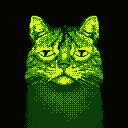

# H3ll0 W0rLD!
\
"M30W. MY N4M3 1S DATAC4T. 4NSW3R QU3ST10Ns 2 F33D M3. M4NY TH1NGS 1 H4V3 2 0FF3R."

# Virtual C4T Companion
Each student has their virtual C4T, who needs to be fed and cared for. You can choose their name, color, and other features to create a personal connection.

# Math Questions
To feed, students must answer math questions correctly. This will earn them points that they can use to buy treats or other things that will make them very happy.

# Mood
"M3 W1TH0UT F00D M4K3 M3 V3RY S4D. M3 W1TH F00D M4K3 M3 H4PPY. M0R3 H4PPY M34N M0R3 P01NT5, BUT M0R3 P01NT M34N M0R3 CH4LL3NG3."

M3 S4D:\

M3 N0RM4L:\

M3 H4PPY:\

# Virtual Cat Care
Along with answering math questions, students can buy their C4T things like toys and games so that they can have fun. They can get yarn and toy mice, or play games with with them like Rock Paper Scissors.

# Dashboard
Teachers and parents can monitor their students'/childrens' progress through a dashboard. They can track how well they are doing and input/remove their own questions.

# Credits
<a href="credits.md">Credits</a>
